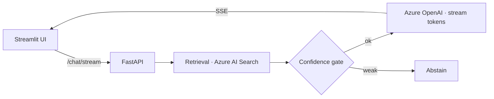

# Streaming RAG Chatbot — Technical-Manual Q&A (SSE + FastAPI)

> An end-to-end chatbot (Streamlit frontend + FastAPI backend) that answers questions over **technical manuals**: grounded, citation-backed answers streaming in token-by-token over Server-Sent Events. The manual index it retrieves from is built by [rag-data-ingestion-pipeline-azure](https://github.com/srikanthot/rag-data-ingestion-pipeline-azure).

  

## What this project is
A focused demonstration of a **low-latency streaming** RAG pipeline over technical-manual content — the retrieval → confidence-gate → stream loop that makes a chatbot feel responsive while staying grounded. Pair it with the [manual indexing pipeline](https://github.com/srikanthot/rag-data-ingestion-pipeline-azure) that ingests, chunks, and embeds the PDFs this chatbot answers from.

## What it actually does (implemented)
- **SSE token streaming** with keepalive pings (no long blank waits).
- **Hybrid + vector retrieval** via Azure AI Search.
- **Confidence gate** — abstains when retrieval evidence is weak instead of guessing.
- **Citations** drawn only from retrieved chunks.
- **Microsoft Agent Framework SDK** orchestration; **Streamlit** front end.

## Architecture


## Run it
```bash
cp .env.example .env
pip install -r backend/requirements.txt
uvicorn app.main:app --reload
streamlit run frontend/app.py
```

---
