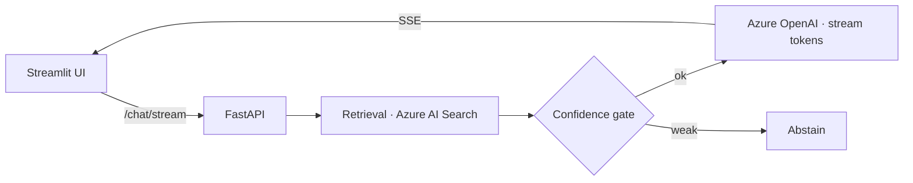

# Streaming RAG Chatbot — SSE + FastAPI

> A streaming RAG chatbot: ask a question and watch a grounded, citation-backed answer stream in token-by-token over Server-Sent Events. FastAPI backend on the Microsoft Agent Framework, with a Streamlit UI.

  

## What this project is
A focused demonstration of a **low-latency streaming** RAG pipeline — the retrieval → confidence-gate → stream loop that makes a chatbot feel responsive while staying grounded.

## What it actually does (implemented)
- **SSE token streaming** with keepalive pings (no long blank waits).
- **Hybrid + vector retrieval** via Azure AI Search.
- **Confidence gate** — abstains when retrieval evidence is weak instead of guessing.
- **Citations** drawn only from retrieved chunks.
- **Microsoft Agent Framework SDK** orchestration; **Streamlit** front end.

## Architecture


## Run it
```bash
cp .env.example .env
pip install -r backend/requirements.txt
uvicorn app.main:app --reload
streamlit run frontend/app.py
```

---
